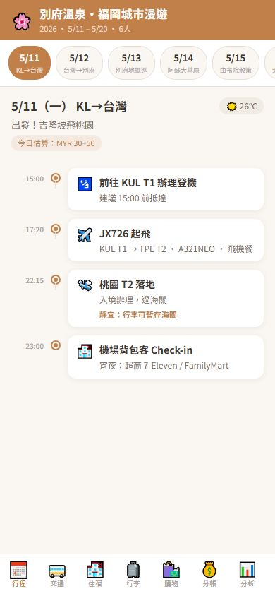
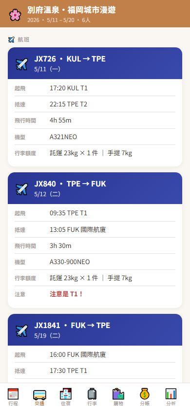
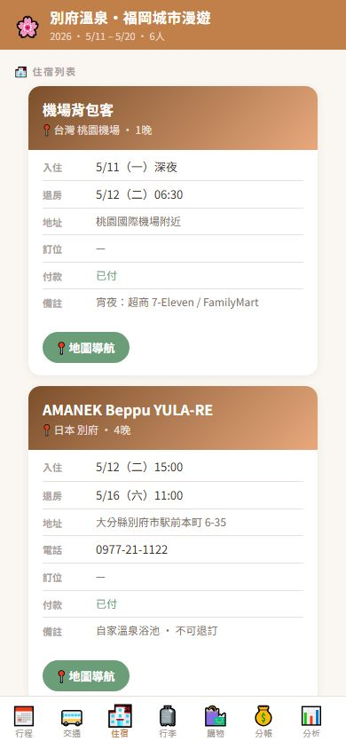
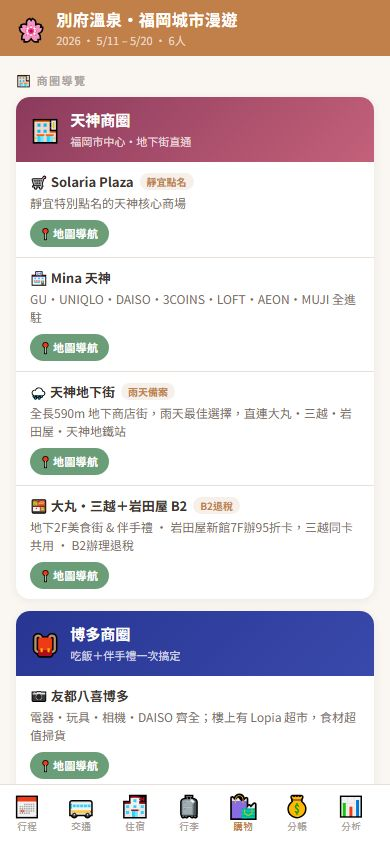
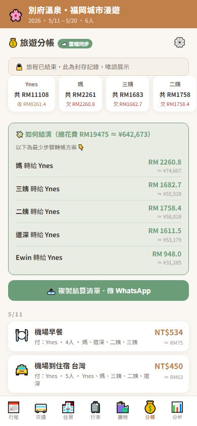
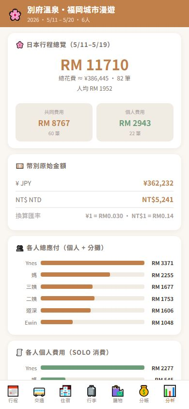
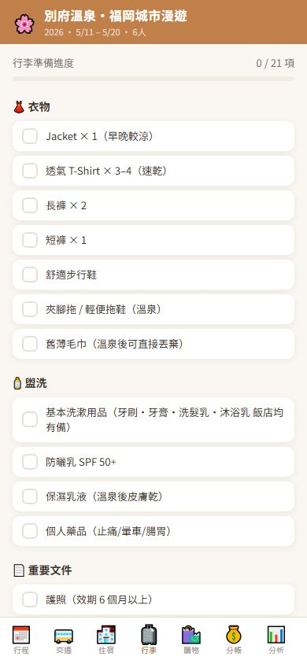

# 九州・福岡家庭旅遊 App

[English README →](README.md)

為 2026 年 5 月一趟 6 人家族旅行打造的行動版旅遊助理 App。涵蓋逐日行程、交通、住宿、行李、購物，以及**多幣別即時分帳同步**——整個 App 只有一個 HTML 檔案，不需要任何建置工具。

**[線上 Demo →](https://ynescy.github.io/fukuoka-family-travel/)**

---

## 畫面截圖

<table>
  <tr>
    <td align="center"><br/><sub>📅 行程</sub></td>
    <td align="center"><br/><sub>🚌 交通</sub></td>
    <td align="center"><br/><sub>🏨 住宿</sub></td>
    <td align="center"><br/><sub>🛍️ 購物</sub></td>
  </tr>
  <tr>
    <td align="center"><br/><sub>💰 分帳</sub></td>
    <td align="center"><br/><sub>📊 分析</sub></td>
    <td align="center"><br/><sub>🧳 行李</sub></td>
    <td></td>
  </tr>
</table>

---

## 功能介紹

### 💰 即時多人分帳（核心技術功能）
6 位家人在不同手機上記帳，金額支援日圓 / 馬幣 / 台幣三種幣別；透過 Firebase Realtime Database 即時同步，統一換算為馬幣比較。

- 每筆費用記錄付款人、分擔成員、費用類別
- 結算面板以**最少轉帳筆數**清算所有債務（greedy 債主債務配對演算法）
- 一鍵「複製結算清單・傳 WhatsApp」，讓家人即時知道欠誰多少
- 離線時自動切換為 `localStorage`；重新連線後無縫同步

### 📅 行程
5/11–5/20 逐日時間軸，含時間點、行程說明、當日預估花費、天氣、每個景點的 Google Maps 連結。

### 🚌 交通
所有航班、高速巴士、租車資訊集中管理，包含訂位代號、出發時間、票價與注意事項。

### 🏨 住宿
飯店卡片包含入退房時間、地址、訂單編號、付款狀態與地圖導航。

### 🧳 行李
24 項打包清單，依類別分組，附完成進度計數器。

### 🛍️ 購物
依地點（天神、博多）整理的商場導覽，含地圖連結、免稅辦理說明。

### 📊 消費分析
旅程後的費用拆解：總花費、人均金額、共同 vs. 個人費用，以及每人橫向長條圖。

---

## 技術棧

| | |
|---|---|
| **前端** | 原生 JS、HTML、CSS，無框架、無建置流程 |
| **即時同步** | Firebase Realtime Database（SDK 9.x compat 模式）|
| **離線支援** | `localStorage` fallback，UI 層完全透明 |
| **版面** | Mobile-first，390px viewport，CSS 自訂屬性設計 token |
| **部署** | GitHub Pages |

---

## 架構說明

整個 App 以單一 `index.html`（約 1,800 行）出貨。這是刻意的設計決策：檔案可以直接在手機瀏覽器開啟，不需要伺服器，也可以用 WhatsApp 傳送，部署到任何靜態空間。

```
index.html
├── CSS 設計 token（--pri, --bg, --txt …）
├── 靜態資料（行程天數、住宿、交通、行李、購物）
├── Firebase 初始化 + Realtime Database listener
├── Tab 路由器（sw(id)，不需要 history API）
├── 分帳引擎
│   ├── getSplitData() / saveSplitData()  ← Firebase 或 localStorage
│   ├── toMYR()                           ← 幣別正規化
│   ├── calcSettlement()                  ← 最少交易數演算法
│   └── renderSplit()                     ← 餘額卡片 + 結算 UI
└── 各 tab 的 render 函式
```

---

## Firebase 安全規則

旅行期間資料庫使用開放讀寫規則，讓家人可以隨時記帳。旅程結束後改為唯讀封存：

```json
{
  "rules": {
    ".read": true,
    ".write": false
  }
}
```

UI 同步反映封存狀態——寫入操作按鈕全部隱藏，分帳頁頂部顯示封存提示。

---

## 本地執行

直接用瀏覽器開啟 `index.html`，不需要安裝任何東西。

如果要接自己的 Firebase 專案，修改 `index.html` 內的設定：

```js
const FIREBASE_CFG = {
  apiKey: "...",
  databaseURL: "...",
  projectId: "...",
};
```

將 `TRIP_ARCHIVED = false` 改回即可重新啟用寫入功能。
